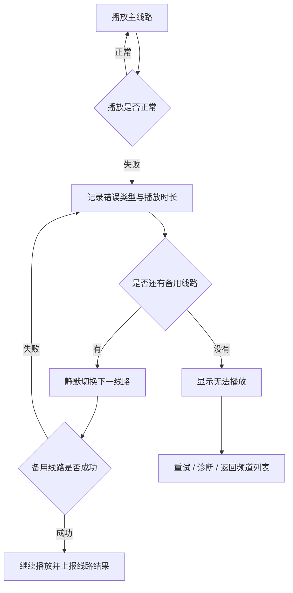

# Magi TV：Android TV IPTV 产品与版本规划

> 文档状态：产品规划草案  
> 更新日期：2026-07-27  
> 产品定位：以 Magi Server 为后台的 Android TV IPTV 播放端

## 1. 产品结论

Magi TV 不应定位成另一个通用 M3U 播放器，也不应正面复制 TiviMate、Sparkle TV 或 Televizo。

更适合当前项目的方向是：

> 一个以 Magi 为后台，具备多源聚合、频道整理、线路健康检测和自动切换能力的 Android TV 播放端。

Magi Web 负责复杂配置，Magi Server 负责数据和播放决策，Magi TV 负责简单、稳定的观看体验。

核心体验应保持为：

> 用户打开电视、选择频道、稳定播放；源管理和复杂处理全部由 Magi 后台完成。

## 2. 当前项目基础

当前 Magi 项目已经具备较完整的 IPTV 管理后台能力：

- 管理多个 M3U、XMLTV 数据源。
- 配置主源、备份源、补充源、测试源及优先级。
- 同步、归一和整理频道。
- 统一频道名称、分组、台标和 EPG。
- 检测线路状态、响应时间、分辨率、码率及编码格式。
- 一个频道关联多条播放线路。
- 指定主线路并支持后备线路。
- 输出整理后的 M3U 和 XMLTV。
- 已有 Web 管理端、用户登录、任务队列及安全操作机制。

相关实现：

- [`apps/api/src/http/output/output.controller.ts`](../apps/api/src/http/output/output.controller.ts)
- [`apps/api/src/domain/output-composition/channel-stream.model.ts`](../apps/api/src/domain/output-composition/channel-stream.model.ts)
- [`apps/api/src/domain/source-management/source.model.ts`](../apps/api/src/domain/source-management/source.model.ts)
- [`apps/api/src/infrastructure/database/schema/auth.ts`](../apps/api/src/infrastructure/database/schema/auth.ts)

当前主要缺口：

- Android TV 原生客户端。
- 电视设备配对和授权。
- 面向播放器的稳定只读 API。
- 客户端播放失败自动换线协议。
- 收藏、最近观看、播放历史等用户状态。
- 设备管理、设备额度和商业订阅。
- DVR、时移、Catch-up 和多画面等高级功能。

## 3. 产品职责划分

| 模块 | 主要职责 |
|---|---|
| Magi Web | 添加数据源、频道整理、EPG 匹配、线路管理、设备管理 |
| Magi Server | 数据同步、健康检测、线路排序、设备认证、播放决策 |
| Magi TV | 频道浏览、节目单、播放、收藏、搜索、失败换线 |
| 上游 IPTV | 实际提供视频流，Magi 本身不提供内容 |

### 3.1 产品原则

- 所有复杂配置都放在 Web，不让用户使用遥控器输入 M3U URL。
- TV 首次启动只处理服务器发现和设备配对。
- 正常启动后三步以内开始播放。
- 播放失败优先自动恢复，不立即暴露技术错误。
- 第一版只做直播，不做大而全的媒体中心。
- Android TV 客户端不直接复用后台管理界面。
- TV 端不提供 M3U、XMLTV、频道合并和线路编辑功能。
- 第一版不接受任意 M3U，不内置任何频道或内容。

## 4. 市场定位

成熟 IPTV 播放器已经覆盖大量通用能力：

| 产品 | 主要特点 |
|---|---|
| TiviMate | TV 优先、多列表、Catch-up、录制、搜索、家长控制、多画面和个性化 |
| Sparkle TV | DVR、时移、自动帧率、多种 PVR 后端和多种 IPTV 协议 |
| Televizo | 操作简单，支持手机、平板和 Android TV，拥有较大用户规模 |

Magi TV 不以功能数量与这些产品竞争，而以后台能力形成差异：

- 自动整理频道。
- 合并重复频道。
- 持续检测线路质量。
- 为不同频道维护多条线路。
- 根据健康度动态排序。
- 播放失败自动切换备用线路。
- 在 Web 端统一管理多个电视设备。

建议对外表达为：

> Magi TV 是一个播放器，只播放用户自己在 Magi Server 中配置并有权访问的内容，不提供任何频道或媒体资源。

参考：

- [TiviMate 官方功能](https://tivimate.com/dashboard/subscription)
- [Sparkle TV](https://play.google.com/store/apps/details?id=se.hedekonsult.sparkle)
- [Televizo](https://play.google.com/store/apps/details?id=com.ottplay.ottplay)

## 5. 总体实施路线

### 5.1 阶段 0：使用成熟播放器验证 Magi

开发 Android 客户端前，先使用 TiviMate、Sparkle TV 或 Televizo 接入 Magi：

- `/output/m3u`
- `/output/xmltv`

建议连续使用 2～4 周，并记录：

- 频道切换速度。
- 首帧耗时。
- EPG 匹配准确率。
- 无法播放的格式和编码。
- 上游线路失效频率。
- 主备线路选择是否合理。
- 用户实际高频操作。
- DVR、时移和多画面是否确有需求。

当前输出接口受登录保护，传统 IPTV 播放器通常不方便携带 Web Session Cookie。因此需要增加播放器友好的独立播放密钥或设备令牌，不应直接公开输出接口。

### 5.2 阶段 1：定义 TV 客户端协议

单独设计面向播放器的只读 Player API：

- 设备配对。
- 频道分组。
- 频道列表。
- 当前和下一节目。
- EPG 时间轴。
- 收藏和最近观看。
- 获取某频道的可用线路。
- 播放失败上报。
- 请求下一条备用线路。
- 远程刷新配置。
- 客户端版本和能力协商。

### 5.3 阶段 2：Android TV MVP

第一版控制在六类页面内：

1. 配对页。
2. 首页。
3. 直播频道页。
4. EPG 节目单。
5. 全屏播放页。
6. 设置与诊断页。

## 6. Android 技术方向

推荐：

- Kotlin。
- Jetpack Compose for TV。
- AndroidX Media3 / ExoPlayer。
- MediaSession。
- 独立 Android TV 工程。

不优先选择 React Native、Flutter 或 WebView，主要原因是 IPTV 客户端的核心风险不在普通页面，而在：

- 遥控器焦点管理。
- 不同电视芯片及硬件解码器兼容性。
- 音轨、字幕、HDR 和画面比例。
- 自动刷新率。
- 后台播放和 MediaSession。
- 直播状态恢复。
- 长时间播放稳定性。

第一版建议最低支持 Android TV 9，并以真实设备测试为主。

参考：

- [Media3 支持格式](https://developer.android.com/media/media3/exoplayer/supported-formats)
- [Media3 设备支持说明](https://developer.android.com/media/media3/exoplayer/supported-devices)
- [Android TV 发布检查表](https://developer.android.com/training/tv/publishing/checklist)

## 7. 版本规划

假设已有 Magi 后台，由一名 Android 开发配合现有后端推进，V1.0 预计需要 12～16 周。兼职开发可按 4～6 个月估算。

### 7.1 V0.1：内部技术验证版

目标：证明真实电视可以稳定播放 Magi 频道。

预计周期：2～3 周。

功能：

- 手动填写 Magi Server 地址。
- 临时设备令牌。
- 获取频道分组。
- 获取频道列表。
- 播放单个频道。
- 支持 HLS、MPEG-TS 等基础格式。
- 音轨选择。
- 字幕选择。
- 播放错误分类。
- 简单线路切换。
- 调试信息页。

暂不包含：

- 正式配对。
- 完整首页。
- 收藏。
- 完整 EPG。

验收条件：

- 至少在三种真实 Android TV 设备运行。
- 连续播放四小时不崩溃。
- 遥控器可以完成全部操作。
- 可以统计频道点击到首帧的耗时。
- 可以区分网络、HTTP、播放源和解码错误。
- 播放器退出后正确释放资源。

### 7.2 V0.3：产品原型版

目标：形成完整的首次使用和日常观看路径。

预计周期：3～4 周。

新增功能：

- 二维码和六位码配对。
- 设备自动登录。
- 首页。
- 最近观看。
- 收藏频道。
- 频道分组。
- 当前节目和下一节目。
- 简化版节目单。
- 搜索频道。
- 开机恢复上次状态。
- 服务端地址修改。
- 设备解绑。
- 数据手动刷新。

验收条件：

- 用户不使用键盘即可完成配对。
- 配对完成后自动进入首页。
- 首页三次按键以内开始播放。
- 返回键行为稳定、可预测。
- 每个页面都有明确默认焦点。
- App 重启后保留登录、收藏和最后频道。

### 7.3 V0.5：日常可用 Beta

目标：可以代替通用播放器进行日常观看。

预计周期：3～4 周。

新增功能：

- 完整 EPG 时间轴。
- 频道快速切换。
- 返回上一个频道。
- 数字键换台。
- 收藏分组。
- 节目信息详情。
- 自动切换播放线路。
- 手动选择线路。
- 线路质量显示。
- 画面比例切换。
- 播放缓冲设置。
- 自动刷新率选项。
- 基础家长锁。
- 网络断开恢复。
- 后台配置变更提示。
- 离线缓存频道目录和 EPG。

验收条件：

- 主线路失效时，无需退出播放页即可换线。
- 短暂断网恢复后自动继续播放。
- 数千频道列表仍可流畅滚动。
- EPG 时间轴无明显卡顿。
- 焦点切换无丢失、无死区。
- 连续换台 100 次不崩溃。
- 日志不暴露 Token、Cookie 和源密码。

### 7.4 V0.8：发布候选版

目标：解决兼容性、稳定性和商店审核问题。

预计周期：2～3 周。

新增功能：

- 首次启动说明。
- 隐私政策和使用条款。
- “播放器不提供任何内容”声明。
- 数据采集开关。
- 崩溃与播放质量统计。
- 版本更新提示。
- 后台设备远程注销。
- 设备名称和最后在线时间。
- TV 启动图、横幅和商店截图。
- 多语言基础框架。
- 无障碍标签。
- 弱性能设备降级策略。

重点测试设备：

- Chromecast / Google TV。
- 小米 TV Stick 或 Mi Box。
- NVIDIA Shield。
- 至少两种品牌电视。
- 一款低性能通用 Android TV 盒子。

### 7.5 V1.0：正式版

目标：形成稳定、简单并具有 Magi 差异化能力的直播播放器。

正式范围：

- Magi Server 配对。
- 首页。
- 频道分组。
- 收藏。
- 最近观看。
- 搜索。
- EPG。
- 快速换台。
- 音轨和字幕。
- 自动换线。
- 手动换线。
- 播放诊断。
- 家长控制。
- 设备管理。
- 自动同步。
- 基础多语言。

明确不包含：

- DVR 录像。
- 直播时移。
- 多画面。
- VOD 电影和电视剧。
- 任意 M3U 导入。
- Xtream Codes。
- 手机和平板适配。
- 推荐算法。
- 完整多用户体系。

### 7.6 V1.1：体验增强版

根据 V1.0 使用数据选择功能：

- 开机直接播放指定频道。
- 自定义首页栏目。
- 频道隐藏。
- 收藏排序。
- 多套收藏夹。
- 节目提醒。
- 更详细的播放统计。
- 服务端远程触发客户端刷新。
- 频道台标主题。
- 多个 Magi Server 切换。
- 手机遥控及推送频道到电视。

### 7.7 V1.5：Catch-up 与多用户

前提是上游节目源确实支持：

- Catch-up 回看。
- 从节目详情直接回看。
- 家庭成员档案。
- 各成员独立收藏和历史。
- 儿童模式。
- 观看时长限制。
- PIN 码保护成人分组。
- 多设备数据同步。

### 7.8 V2.0：高级播放平台

候选功能：

- 本地 DVR。
- 服务端 DVR。
- 直播时移。
- 多画面。
- 计划录像。
- 剧集录像。
- 家庭服务器播放代理。
- 服务端转码。
- 付费订阅和设备额度。
- Fire TV 正式适配。

只有 V1.0 获得稳定用户后才建议投入这一阶段。

## 8. 页面信息架构

主导航控制在六项：

```text
Magi TV
├── 首页
├── 直播
│   ├── 频道分组
│   ├── 频道列表
│   └── 当前/下一节目
├── 节目单
├── 收藏
├── 搜索
└── 设置
    ├── 播放设置
    ├── 家长控制
    ├── 数据同步
    ├── 设备信息
    ├── 播放诊断
    └── 退出/解绑
```

以下管理能力继续保留在 Magi Web：

- 数据源添加和编辑。
- M3U/XMLTV 同步。
- EPG 匹配。
- 频道合并。
- 台标管理。
- 线路编辑。
- 主备线路配置。
- 批量频道操作。

## 9. 核心功能路径

### 9.1 首次配对


异常处理：

- 找不到服务器：允许输入局域网地址。
- 服务器证书异常：明确提示，不静默忽略。
- 配对码过期：自动生成新码。
- Web 拒绝配对：TV 保留在等待状态。
- Server 版本不兼容：显示客户端所需最低版本。

### 9.2 日常启动

```text
启动
→ 验证本地设备令牌
→ 展示缓存首页
→ 后台同步频道与 EPG
→ 恢复首页焦点
```

原则：

- 不要每次启动都显示阻塞式加载页。
- 优先展示上次缓存数据。
- 后台静默刷新。

令牌失效：

```text
启动
→ 设备令牌失效
→ 显示“设备授权已失效”
→ 重新配对
```

### 9.3 首页观看

首页栏目顺序：

1. 继续观看或上次频道。
2. 收藏频道。
3. 基于用户自身数据生成的常看频道。
4. 最近观看。
5. 频道分组。
6. 服务状态提示。

主要路径：

```text
首页
→ 收藏频道卡片获得焦点
→ 显示当前节目和进度
→ 按 OK
→ 全屏播放
```

首页以频道为核心，不设计成电影海报墙。

### 9.4 直播频道浏览

推荐三栏式布局：

```text
左栏：频道分组
中栏：频道列表
右栏：当前/下一节目及频道信息
```

操作：

```text
直播
→ 左右切换区域
→ 上下选择分组或频道
→ OK 播放
→ 返回时恢复刚才选中的频道
```

### 9.5 播放页

正常播放时只显示视频。

按一次 OK 后显示控制层：

- 当前频道。
- 当前和下一节目。
- 节目进度。
- 当前线路状态。
- 音轨。
- 字幕。
- 画面选项。

遥控器行为：

| 按键 | 行为 |
|---|---|
| OK | 显示或隐藏播放控制层 |
| 上/下 | 切换上一或下一频道 |
| 左 | 打开最近频道或返回上一个频道 |
| 右 | 打开频道列表 |
| Back | 先关闭浮层，再退出播放 |
| Channel + / - | 换台 |
| 数字键 | 输入频道号 |
| 长按 OK | 打开播放快捷设置 |

Back 键不应一次直接退出 App。

### 9.6 自动换线



触发条件：

- 建立连接超时。
- HTTP 4xx/5xx。
- 长时间无首帧。
- 播放中断且恢复失败。
- 解码器无法处理该线路。
- 连续缓冲超过阈值。

提示策略：

- 第一次失败：静默换线，仅显示“正在优化线路”。
- 所有线路失败：显示完整错误页。
- 用户手动指定线路后：本次播放优先尊重用户选择。
- 轻微缓冲不频繁换线，避免触发上游连接数限制。

### 9.7 EPG

```text
节目单
→ 左侧频道固定
→ 右侧时间轴横向移动
→ OK 查看节目详情
→ 当前节目：立即播放
→ 未来节目：设置提醒
→ 历史节目：若支持 Catch-up，则显示回看
```

V1.0 范围：

- 当前节目。
- 下一节目。
- 当日时间轴。
- 节目信息详情。

多日 EPG 和节目提醒放到 V1.1。

### 9.8 搜索

```text
搜索
→ TV 软键盘或语音输入
→ 同时搜索频道和节目
→ 按频道、正在播、稍后播出分组
→ OK 进入播放或节目详情
```

第一版只追求速度和准确性，不做复杂推荐。

### 9.9 收藏

```text
频道卡片长按 OK
→ 加入或取消收藏
→ 首页收藏栏目即时更新
→ 同步到 Magi Server
```

网络不可用时先保存到本地，恢复网络后再同步。

### 9.10 播放诊断

```text
设置
→ 播放诊断
→ 设备解码能力
→ 网络状态
→ 当前线路格式
→ 首帧耗时
→ 缓冲次数
→ 最近错误
→ 生成脱敏诊断编号
```

诊断信息不能包含：

- 完整播放 URL。
- Authorization。
- Cookie。
- M3U 用户名和密码。
- 设备令牌。

## 10. 播放线路策略

### 10.1 默认直连

Magi 返回真实流地址和必要请求头，电视直接连接上游。

优点：

- Magi Server 不承担视频带宽。
- 延迟较低。
- 实施相对简单。

缺点：

- 播放地址和上游凭据会到达电视设备。
- 某些上游存在 IP、User-Agent 或连接数限制。
- 服务端不能完全控制播放会话。

适合自托管和第一版。

### 10.2 Magi 中转

电视只访问 Magi，由 Magi 代理或重封装视频流。

优点：

- 不向设备暴露上游地址。
- 更容易统一鉴权和统计。
- 可以进行服务端换线。

缺点：

- 带宽和服务器成本高。
- 直播代理、断线恢复和 Range 请求复杂。
- 容易把管理后台变成重型流媒体服务。

第一版不建议全量中转。推荐混合模式：

- 默认直连。
- 需要隐藏凭据或兼容特殊请求头的源经过代理。

### 10.3 客户端与服务端协同

1. 服务端根据健康度返回有序线路列表。
2. TV 播放第一条线路。
3. 连续超时、解码失败或无数据时切换下一条。
4. TV 上报失败类型、首帧耗时和播放结果。
5. 服务端更新线路健康度。
6. 新的健康度参与后续设备播放决策。

## 11. Player API 能力

Android TV 开工前应明确以下后端能力：

| 能力 | 用途 | 目标版本 |
|---|---|---|
| 设备配对 | TV 无需输入账户密码 | V0.3 |
| 设备令牌 | 独立、可撤销的客户端身份 | V0.3 |
| Player 首页接口 | 一次返回首页所需数据 | V0.3 |
| 频道增量同步 | 避免每次下载全部频道 | V0.5 |
| EPG 时间范围查询 | 只获取需要的节目区间 | V0.3 |
| 播放决策接口 | 返回有序线路和请求头 | V0.1 |
| 播放结果上报 | 改善线路健康判断 | V0.5 |
| 收藏和历史同步 | 多设备状态一致 | V0.3 |
| 客户端能力协商 | 根据设备能力筛选线路 | V0.8 |
| 远程注销 | 后台撤销丢失设备 | V0.8 |

播放决策不应只返回一个 URL，还应表达：

- 当前首选线路。
- 备用线路顺序。
- 必要请求头。
- 流格式。
- 分辨率和编码。
- 最近健康状态。
- 播放决策有效期。
- 是否允许或要求代理播放。

## 12. 遥控器和焦点规则

Android TV 的核心交互要求：

- 每个页面进入时都有默认焦点。
- 返回上一页时恢复原焦点和滚动位置。
- 聚焦元素有明显放大、描边或亮度变化。
- 焦点不能进入不可见区域。
- 横向列表到达边缘时不能意外跳到其他栏目。
- 长列表快速滚动时，台标加载不能造成卡顿。
- 所有核心功能仅用方向键、OK、Back 即可完成。
- 不依赖触摸、滑动或鼠标。
- 重要文字适合三米外阅读。
- 不照搬手机端底部导航。
- 播放层、频道层和全局导航层的 Back 行为保持一致。

## 13. 商业化和合规

建议销售软件能力，不销售频道：

- 免费版：基础播放、单设备。
- Pro：多设备、同步、自动换线和高级播放设置。
- Server：Magi 后台高级能力、备份和更多数据源。
- 家庭版：多个档案、家长控制和设备管理。

需要提前准备：

- 隐私政策。
- 使用条款。
- “不提供任何频道或内容”的明确声明。
- 举报和下架联系渠道。
- 商店截图不使用未授权电视台或影视素材。
- 不内置来源不明的示例列表。
- 日志隐藏 M3U URL、Token、Cookie 和用户名密码。

Google Play 内销售数字功能或订阅时，需要根据目标市场遵守对应的 Google Play Billing 和替代计费政策：

- [Google Play 支付政策](https://support.google.com/googleplay/android-developer/answer/9858738)

## 14. 发布策略

推荐顺序：

1. 内部 APK，仅支持开发和个人设备。
2. 邀请制测试，覆盖 20～50 台真实设备。
3. Google Play 封闭测试。
4. 正式发布 Android TV 版本。
5. 有明确需求后适配 Fire TV。
6. 最后再考虑手机、平板、WebOS 和 Tizen。

首批设备矩阵：

- Chromecast / Google TV。
- 小米 TV Stick 或 Mi Box。
- NVIDIA Shield。
- 一台低性能通用 Android TV 盒子。
- 至少两台不同厂商的智能电视。

## 15. V1.0 发布指标

建议发布门槛：

- 无崩溃会话率不低于 99.5%。
- 健康线路首帧耗时中位数不超过 3 秒。
- 普通换台耗时中位数不超过 2.5 秒。
- 备用线路切换在 6 秒内完成。
- 配对成功率不低于 95%。
- EPG 匹配频道覆盖率不低于 90%。
- 连续播放四小时无明显内存增长。
- 连续换台 100 次无崩溃。
- 所有主要页面无焦点死区。
- 用户从启动到播放不超过三步。
- 敏感信息全部脱敏。

由于上游网络和 IPTV 源质量不可控，性能统计需要同时记录：

- Magi Server 响应时间。
- 上游连接时间。
- 播放器准备时间。
- 首帧时间。
- 缓冲次数和总时长。
- 播放线路及失败分类。

## 16. 推荐交付主线

```text
阶段 0：使用成熟播放器验证 Magi 输出
→ V0.1：真实设备播放验证
→ V0.3：设备配对、首页、收藏和基础 EPG
→ V0.5：完整 EPG、自动换线和日常可用性
→ V0.8：兼容性、隐私、诊断和商店准备
→ V1.0：正式发布
```

在 V1.0 之前，应持续抵制扩展为通用 IPTV 播放器、媒体中心或视频内容服务。Magi TV 的第一阶段价值不是功能最多，而是：

> 配置简单、频道干净、线路健康、播放稳定。
